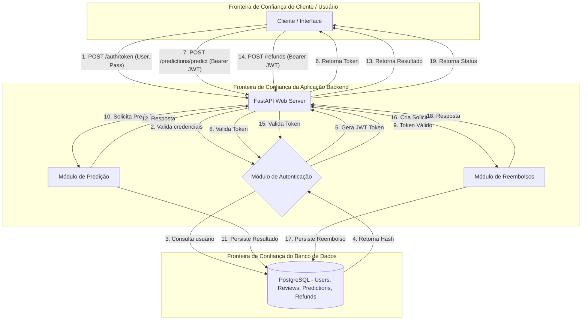

# E-ComShield - Data Flow Diagram & Análise CIA

Este documento contém o diagrama de fluxo de dados (DFD) e a análise da Tríade CIA, cumprindo com as exigências de modelagem de ameaças e segurança do projeto.

## Data Flow Diagram (DFD)

O diagrama abaixo mapeia o fluxo de autenticação e predição, indicando claramente as fronteiras de confiança (Trust Boundaries) e os componentes do sistema.

## Análise da Tríade CIA

A análise da Tríade CIA (Confidencialidade, Integridade, Disponibilidade) foi aplicada aos seguintes componentes do sistema:

### 1. API FastAPI (Web Server)
- **Confidencialidade:** As conexões devem ocorrer sobre TLS (HTTPS) no ambiente de produção para garantir que dados em trânsito (como senhas e tokens JWT) não sejam interceptados.
- **Integridade:** O servidor deve garantir que as rotas só processem requisições bem formatadas, utilizando a validação do Pydantic para evitar *payloads* maliciosos ou injetados.
- **Disponibilidade:** O servidor utiliza o Uvicorn, podendo escalar horizontalmente ou usar *load balancers* para assegurar que a API esteja sempre acessível e respondendo aos chamados dos clientes.

### 2. Módulo de Autenticação / Banco de Dados de Usuários
- **Confidencialidade:** O banco de dados PostgreSQL não armazena as senhas em texto claro. É utilizado o `passlib` com o algoritmo `bcrypt` para gerar e armazenar apenas hashes irreversíveis. As credenciais de conexão ao banco são gerenciadas via variáveis de ambiente (`.env`).
- **Integridade:** Os tokens JWT são assinados digitalmente usando um `SECRET_KEY` forte (HS256). Qualquer tentativa de adulteração de privilégios ou identidade pelo cliente invalidará a integridade do token. O SQLModel/SQLAlchemy previne SQL Injection por padrão através de queries parametrizadas.
- **Disponibilidade:** O PostgreSQL roda em container Docker com volume persistente e healthcheck, garantindo que o serviço esteja sempre acessível. Em produção, pode ser replicado para alta disponibilidade.

### 3. Componente Cliente / Gerenciamento de Token
- **Confidencialidade:** O token de acesso deve ser guardado com segurança pelo lado do cliente (como variáveis de ambiente, cookies HTTP-only, ou mecanismos seguros da plataforma), evitando exposição em logs ou localStorage de forma vulnerável.
- **Integridade:** O cliente não deve (e não consegue, de forma validada) alterar o conteúdo do token, pois isso inviabiliza sua assinatura.
- **Disponibilidade:** O cliente deve gerenciar o ciclo de vida do token, prevendo retentativas e solicitando novos tokens caso o atual expire (implementando *refresh tokens*, se a arquitetura evoluir).

### 4. Banco de Dados PostgreSQL
- **Confidencialidade:** O acesso ao banco é restrito por credenciais configuradas via variáveis de ambiente. A porta 5432 só é exposta ao container da API via rede interna do Docker Compose.
- **Integridade:** Os dados persistidos utilizam constraints (UNIQUE, FOREIGN KEY, CHECK) definidos pelo SQLModel para garantir consistência referencial entre Users, Reviews, Predictions e RefundRequests.
- **Disponibilidade:** Os dados são persistidos em volume Docker nomeado (`pgdata`), garantindo que sobrevivam a reinicializações dos containers.
