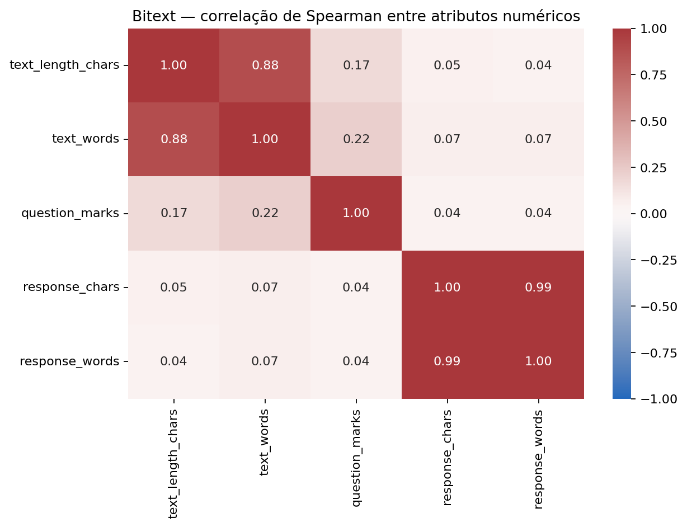
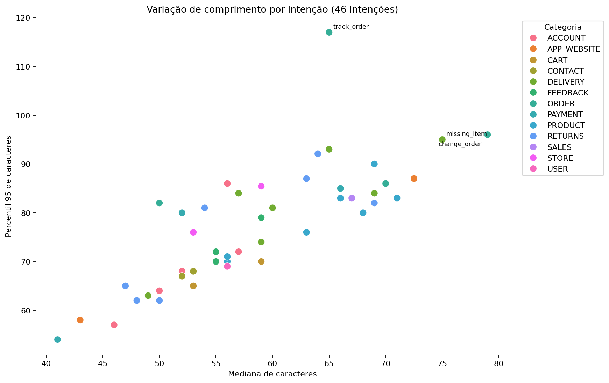
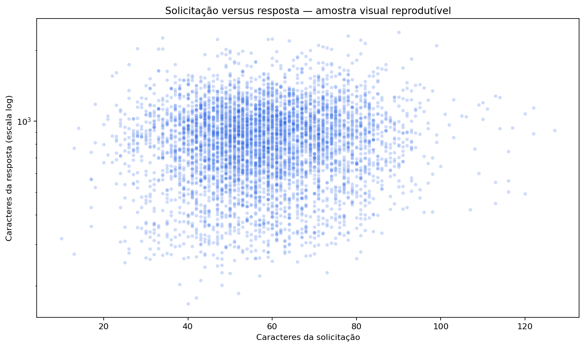
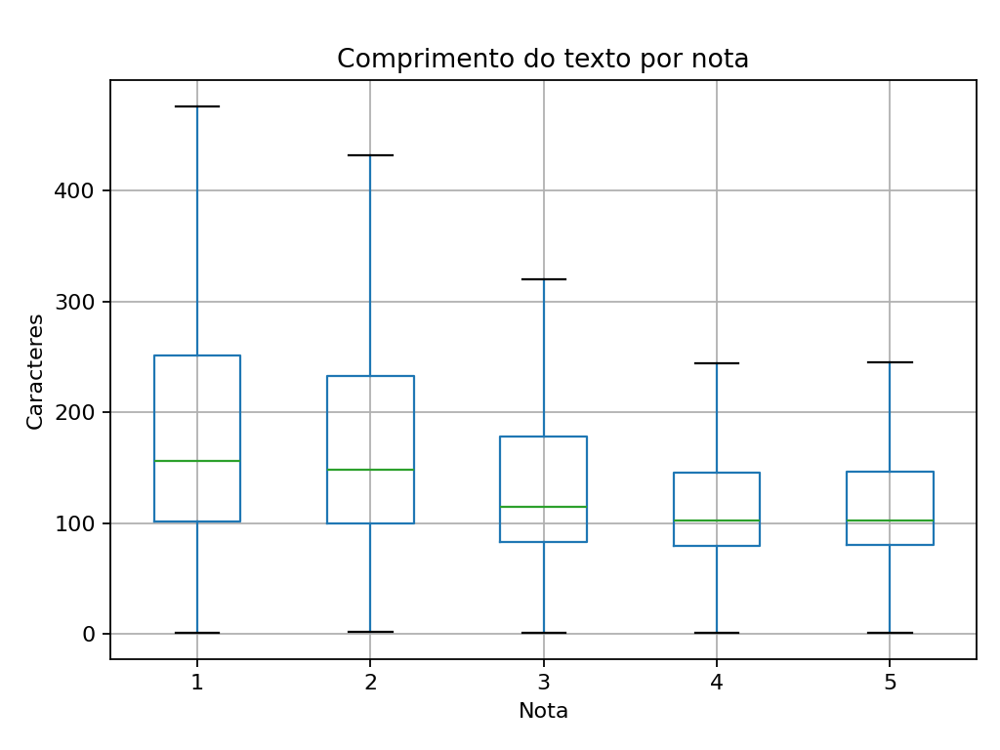

# TP2 — relatório de análise exploratória de dados

## Problema

O E-ComShield precisa entender solicitações de atendimento antes de avançar
para a classificação automática de intenções. Após o feedback do TP1, a
análise separou duas fontes com papéis distintos: o Bitext fornece rótulos de
intenção publicados pela fonte; o B2W-Reviews01 fornece avaliações reais em
português, mas não possui intenção original. Este TP aprofunda a EDA com
correlações, relações visuais e um teste formal de uma hipótese registrada no
TP1. Nenhum rótulo de
intenção é inferido da nota ou por palavras-chave.

## Dados

| Fonte e finalidade | Volume utilizado | Origem e licença |
| --- | ---: | --- |
| Bitext Retail eCommerce — EDA principal de intenções | 44.884 solicitações, 46 intenções e 13 categorias | [Fonte Bitext](https://huggingface.co/datasets/bitext/Bitext-retail-ecommerce-llm-chatbot-training-dataset), CDLA-Sharing-1.0 |
| B2W-Reviews01 — feedback real e teste da hipótese do TP1 | 132.373 linhas originais; 131.347 após remover 72 textos vazios e 954 duplicatas exatas | [Fonte B2W Digital](https://github.com/americanas-tech/b2w-reviews01), CC BY-NC-SA 4.0 |

Os downloads são fixados por revisão e SHA-256 nos scripts
[`build_bitext_intent_dataset.py`](../../scripts/build_bitext_intent_dataset.py)
e [`download_b2w_reviews.py`](../../scripts/download_b2w_reviews.py). O
Bitext foi separado em treino, validação e teste por intenção, mantendo textos
idênticos na mesma partição: zero sobreposições textuais exatas entre elas.
As respostas de referência (`response`) do Bitext entram apenas na descrição
dos dados, nunca como entrada do classificador.

No B2W, `feedback_text` é título + corpo com espaços normalizados. A nota é
metadado original de satisfação, **não** rótulo de intenção. As avaliações
observadas cobrem janeiro a maio de 2018. Os procedimentos de limpeza e as
distribuições iniciais estão nos notebooks
[`03_b2w_feedback_eda.ipynb`](../../notebooks/03_b2w_feedback_eda.ipynb)
e [`04_bitext_intent_eda.ipynb`](../../notebooks/04_bitext_intent_eda.ipynb).

## Análise

### Intenções e correlações no Bitext

Entrega, produto e devoluções somam 20.199 solicitações (45,00%). `RETURNS`
tem 6.925 registros, 2,32 vezes o volume de `FEEDBACK` (2.980). Dentro de
`DELIVERY`, as intenções `delivery_issue`, `delivery_time` e `track_delivery`
somam 2.912 registros (44,15%). São **frequências do corpus**, não estimativas
da demanda operacional brasileira.

O heatmap usa correlação de **Spearman** entre comprimento da solicitação em
caracteres e palavras, presença de interrogação e comprimento da resposta em
caracteres e palavras. Esses atributos são numéricos; `category` e `intent`
são nominais e não foram convertidos em números arbitrários. O cálculo usa as
44.884 linhas.



Caracteres e palavras da mesma solicitação têm correlação de aproximadamente
0,88; as duas medidas da resposta, aproximadamente 0,99. Essas associações
são em grande parte mecânicas. Já comprimento da solicitação e da resposta
têm correlação de apenas **0,05**: uma pergunta mais longa não implica, neste
corpus, uma resposta proporcionalmente mais longa. Correlação não indica
causalidade nem desempenho de classificação.

O primeiro scatter plot representa **todas as 46 intenções**, com mediana e
percentil 95 do comprimento da solicitação por intenção. `track_order` tem o
maior percentil 95, **117 caracteres**, enquanto o percentil 95 global é
**84 caracteres**. O segundo plot mostra solicitação versus resposta para uma
amostra visual reprodutível de 5.000 linhas (`random_state=42`); o eixo da
resposta é logarítmico para acomodar sua amplitude. A amostra é usada só para
legibilidade visual, não para as estatísticas.





### Teste formal de hipótese no B2W

A hipótese 2 documentada no TP1 foi: **avaliações negativas tendem a ter
textos mais longos**. Comparamos notas 1–2 com notas 4–5; nota 3 fica fora
dos dois grupos. A hipótese nula é ausência de deslocamento estocástico entre
as distribuições de comprimento; a alternativa unilateral é que o grupo 1–2
tende a apresentar comprimentos maiores. Usamos Mann–Whitney U assintótico
com correção para empates, pois a distribuição de comprimentos é assimétrica.
O teste usa todas as avaliações elegíveis após a limpeza do TP1.

| Análise | Notas 1–2 | Notas 4–5 | Medianas (caracteres) | p unilateral | Probabilidade de superioridade | Delta rank-biserial |
| --- | ---: | ---: | ---: | ---: | ---: | ---: |
| Todas as avaliações | 35.020 | 80.111 | 154 vs. 102 | < 10⁻³⁰⁰ | 0,6771 | 0,3541 |
| Sensibilidade: primeira avaliação cronológica por revisor | 31.313 | 69.028 | 154 vs. 102 | < 10⁻³⁰⁰ | 0,6762 | 0,3523 |

No teste principal, U = 1.899.459.581,5 e a diferença **descritiva** de
medianas é de 52 caracteres. A probabilidade de superioridade de 0,6771
significa que, em um par de avaliações de grupos distintos, a de nota baixa
tende a ser mais longa em cerca de 67,7% das comparações, contando empates
pela metade. O p-valor é apresentado como limite porque o valor numérico
calculado é extremamente pequeno; **não** significa probabilidade zero.



Entre as avaliações elegíveis, há 14.790 linhas além da primeira avaliação
de cada revisor. A análise de sensibilidade reduz essa dependência e conserva
praticamente o mesmo tamanho de efeito. O teste de Mann–Whitney compara
posições das distribuições; ele não prova diretamente igualdade ou diferença
de medianas sem hipóteses adicionais sobre suas formas.

## Insights principais

1. O Bitext fornece rótulos de intenção originais suficientes para estudar
   46 classes; a análise não depende das antigas regras heurísticas aplicadas
   ao B2W.
2. Comprimentos variam entre intenções. Para uma futura escolha de limite de
   tokens, convém verificar caudas por intenção, não apenas a média geral.
   Os valores aqui estão em **caracteres**, não em tokens.
3. No B2W observado, avaliações de nota baixa tendem a ter textos maiores.
   A evidência inclui um efeito de ordenação além de um p-valor muito pequeno,
   e persiste na verificação com uma avaliação por revisor.

## Limitações

- O Bitext é em inglês e se descreve como híbrido/sintético; as frequências,
  correlações e comprimentos não representam automaticamente chamados reais
  em português. A resposta de referência pode refletir seu processo de
  geração, não uma resposta operacional de atendimento.
- O B2W contém **avaliações de produto**, não chamados anotados por intenção.
  Seus dados são observacionais e de 2018. Nota baixa não causa, por si só,
  textos maiores; categoria de produto, perfil do revisor e seleção de quem
  avalia podem influenciar a associação.
- A hipótese de comprimento foi formulada após a EDA do TP1 sobre esta mesma
  base. Portanto, o p-valor é **exploratório**, não confirmação em amostra
  independente. O grande tamanho amostral também torna importante olhar para
  o tamanho do efeito. A análise por revisor reduz uma fonte de dependência,
  mas não remove todos os possíveis confundidores.
- A amostra de 500 avaliações B2W com rótulos humanos existe para análise
  externa posterior; 78 casos marcados incertos ficam fora da amostra principal
  de 422. Como ela foi balanceada por nota, não estima a distribuição natural
  de intenções em atendimento.

## Próximos passos

Para uma etapa futura de classificação, treinar apenas com os rótulos de
intenção publicados pelo Bitext e manter as partições sem textos idênticos
entre treino e teste. A amostra PT-BR humana deve ser reservada para avaliação
externa, com análise do forte desbalanceamento e dos casos incertos. Nenhuma
métrica interna do Bitext deve ser apresentada como desempenho em português.
Este TP2 não exige treinar um novo modelo nem altera API, banco ou segurança.

### Reprodução da parte de dados

Na raiz do repositório, com Python 3.10 ou superior:

```bash
python -m pip install -r requirements-data.txt
python scripts/download_b2w_reviews.py
python scripts/build_bitext_intent_dataset.py
python scripts/generate_b2w_feedback_eda.py
python -m nbconvert --to notebook --execute --inplace notebooks/03_b2w_feedback_eda.ipynb
python -m nbconvert --to notebook --execute --inplace notebooks/04_bitext_intent_eda.ipynb
```

O notebook Bitext regenera as três figuras deste relatório em
`reports/tp2_data_eda/figures/`; o script B2W regenera a figura do teste.
Os datasets brutos não são versionados por tamanho e licença, mas os scripts
conferem seus hashes antes da análise.
